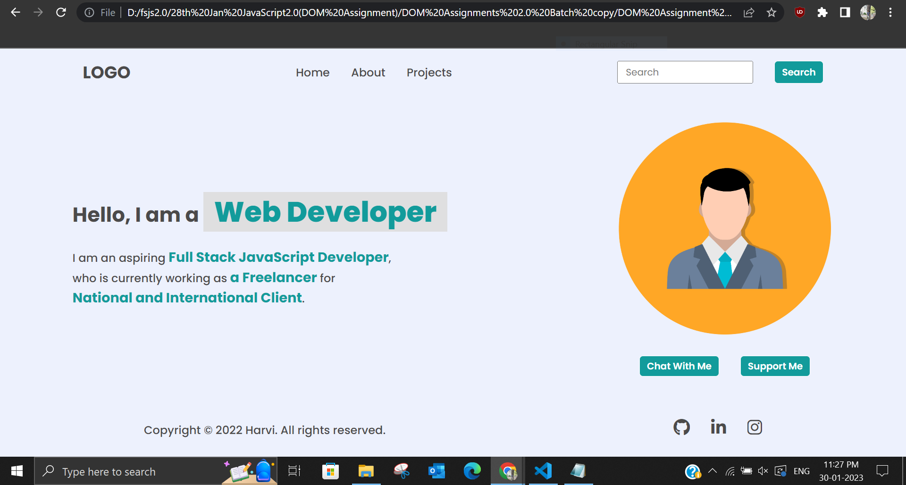

# DOM Assignment

## **Assignment 1**

## Original


## Task 1

```js
//for changing Content in navbar to Projects
document.querySelector("nav ul").lastElementChild.firstElementChild.innerText="Projects"

//To add Hire Me anchor tag in nav bar
const h=document.createElement("li")
h.innerHTML="<a>Hire Me</a>"
document.querySelector("nav ul").appendChild(h)

//To remove from footer various links
document.querySelector("footer ul").style.visibility="hidden"

//To change style of 'a' in paragraph
document.querySelector(".hero-left-section p").innerHTML=`I am an aspiring <span>Full Stack JavaScript Developer</span>,
<br />who is currently working as a<span> Freelancer</span> for <br /><span>National and International Client</span>.`

```
## Task 2


```js
// To change the placeholder in searchbox
document.querySelector(".search-field").firstElementChild.placeholder="Search My Project"

//for changing Content in navbar to Projects
document.querySelector("nav ul").lastElementChild.firstElementChild.innerText="Projects"

//To remove from footer various links
document.querySelector("footer ul").style.visibility="hidden"

//To change style of 'a' in paragraph
document.querySelector(".hero-left-section p").innerHTML=`I am an aspiring <span>Full Stack JavaScript Developer</span>,
<br />who is currently working as a<span> Freelancer</span> for <br /><span>National and International Client</span>.`

```
## Task 3


```js
//To change text in paragraph
document.querySelector(".hero-left-section p").innerHTML=`I am an aspiring <span>Full Stack JavaScript Developer</span>,
<br />who is currently working as <span> an Employee</span> for <br /><span>iNeuron Intelligence Pvt Ltd</span>.`

//for changing 'Content' in navbar to 'Projects'
document.querySelector("nav ul").lastElementChild.firstElementChild.innerText="Projects"
```
## Task 4


```js
// To change image
document.querySelector(".hero-right-section img").src="https://hiteshchoudhary.com/static/a8d73d1aac4c79e9bb689640e6090367/2eaab/person-image.jpg"

//for changing 'Content' in navbar to 'Projects'
document.querySelector("nav ul").lastElementChild.firstElementChild.innerText="Projects"
```
## Task 5



```js
// To add 'Support Me' button below profile pic
let bt=document.createElement("button")
bt.innerText="Support Me"
document.querySelector(".hero-right-section-btns").appendChild(bt)

//for changing 'Content' in navbar to 'Projects'
document.querySelector("nav ul").lastElementChild.firstElementChild.innerText="Projects"​
```

## **Assignment 2**

## Original


## Task 1


```js
// To change color
document.querySelectorAll(".accordian").forEach((e)=>{console.log(e.children[0].style.background="#dadaf8")})

//for changing 'Content' in navbar to 'Projects'
document.querySelector("nav ul").lastElementChild.firstElementChild.innerText="Projects"
```

## Task 2


```js
// To add Skills section
let ele=document.createElement("div")
ele.className="accordian"
ele.innerHTML=`
        <h3>Skills</h3>
        <p style="display:block;">I possess a very good command over the Full Stack Development technologies like MERN which can be seen in my work over the Github</p>
        `
document.querySelector(".accordian-wrapper").appendChild(ele)

// To change color
document.querySelectorAll(".accordian").forEach((e)=>{console.log(e.children[0].style.background="#dadaf8")})

//for changing 'Content' in navbar to 'Projects'
document.querySelector("nav ul").lastElementChild.firstElementChild.innerText="Projects"
```

## **Assignment 3**

## Original


## Task


```js
// To change text in placeholder
document.querySelectorAll(".enterName,.userName").forEach((e)=>{(e.placeholder="FSJS2.0")})
document.querySelectorAll(".enterMail,.userEmail").forEach((e)=>{(e.placeholder="fsjs@ineuron.ai")})
document.querySelectorAll(".enterMessage,.userMessage").forEach((e)=>{(e.placeholder="Hello World")})
```

## **Assignment 4**

## Original


## Task


```js
// To add Archer name
document.querySelector(".archer").children[2].innerHTML="The Archer"

//To add Goblin name
document.querySelector(".goblin").children[2].innerHTML="The Goblin"

//To add color
document.querySelector(".clash-card__unit-stats--barbarian").style.background="#ec9b3b"

document.querySelector(".clash-card__unit-stats--archer").style.background="#ee5487"

document.querySelector(".clash-card__unit-stats--giant").style.background="#f6901a"

document.querySelector(".clash-card__unit-stats--goblin").style.background="#82bb30"

document.querySelector(".clash-card__unit-stats--wizard").style.background="#4facff"

// To add white font color 
document.querySelectorAll(".one-third").forEach((e)=>{e.style.color="#ffffff"})
```
## **Assignment 5**

## Original


## Task


```js
// To add Pro Subscription button
e=document.createElement("a")
e.className="btn"
e.innerText=" Pro Subscription "
document.querySelector(".nav-center").lastElementChild.appendChild(e)

// To add chinese(7) in Recipes
e=document.createElement("a")
e.innerText=" Chinese (7) "
document.querySelector(".tags-container div").appendChild(e)

// To add 6th card
bev=document.createElement("div")
bev.className="card"
bev.innerHTML=`
<a href="#" class="recipe-text">

<h5 class="recipe-name">Coffee</h5>
<p class="recipe-disp">Prep : 10min | Cook : 10min</p>
                    </a>
                    `
document.querySelector(".recipe-gallery").appendChild(bev)

// To change color
document.querySelectorAll(".recipe-text").forEach((r)=>{r.style.color="#5c1b8b"})
```

## **Assignment 6**

## Original


## Task


```js

// adding iNeuron 
document.querySelector("header img").src="https://ineuron.ai/images/ineuron-logo.png"

//To change price
document.querySelector(".app_price span").innerText="$10"

// To add linkedin Icon
li=document.createElement("div")
li.className="footer_social_ico"
li.innerHTML=`<i class="fa-brands fa-linkedin"></i>`
document.querySelector(".footer_social").appendChild(li)
```

## **Assignment 7**

## Original


## Task


```js
// To remove alternate link
document.querySelectorAll(".main__languages a").forEach((e,i,arr)=>{if (i%2==1) {e.remove()
}})

// To add in input form
document.querySelector(".main__form-input").value="iNeuron"

// To add refresh button
ref=document.createElement("input")
document.querySelector(".main").appendChild(ref)
ref.type='button'
ref.style.gridColumn="2"
ref.value="After writing the text submit the form"
ref.style.background="#f23c3c"
ref.style.border="0"
ref.style.textAlign="center"
ref.style.borderRadius="2px"
ref.style.marginLeft="50px"
ref.style.width="360px"
ref.style.height="35px"
ref.style.color="#ffffff"
ref.style.fontSize="20px"
const refreshPage = () => {
  location.reload();
}
ref.addEventListener('click', refreshPage)
```


## **Assignment 8**

## Original


## Task 1


```js
// To make aside scroll
document.querySelector("aside").style.overflowY="scroll"
h=document.createElement("hr")
h.className="hr-line"
document.querySelector("aside").appendChild(h)
he=document.createElement("h2")
he.className="new-head"
he.innerText="This is my custom heading"
document.querySelector("aside").appendChild(he)
document.querySelector("aside").style.outline="3px solid red"
document.querySelector("aside").style.outlineOffset="5px"
document.querySelector("aside").style.borderRadius="1px"
```

## Task 2


```js
// To remove web page background
document.querySelector("body").style.background="#ffffff"
```

## Task 3


```js
// To Add functionality to hamburger button
ele=document.querySelector(".navbar-collapse")
let num=0
document.querySelector(".navbar-toggler").addEventListener('click',()=>{if (num==0){ele.style.display="flex";num=1;}else {ele.style.display="none";num=0;}})
```

## **Assignement 9**

## Original


## Task 1

 

```js
// To change color and font
document.querySelectorAll(".title")[1].style.fontFamily="serif"
document.querySelectorAll(".title")[1].style.color="#dc143c"
```

## Task 2


```js
// To change color of add to cart on hover
ele=document.querySelector(".add-to-cart")
ele.addEventListener('mouseenter',()=>{ele.style.background="#dc143c"})
ele.addEventListener('mouseleave',()=>{ele.style.background="#3c8067"})

```